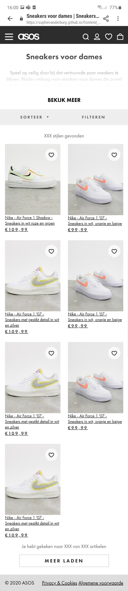

# Procesverslag
**Auteur:** Sophie van der Burg

**URL website:** https://sophievanderburg.github.io/frontend_development/

Markdown cheat cheet: [Hulp bij het schrijven van Markdown](https://github.com/adam-p/markdown-here/wiki/Markdown-Cheatsheet). Nb. de standaardstructuur en de spartaanse opmaak zijn helemaal prima. Het gaat om de inhoud van je procesverslag. Besteedt de tijd voor pracht en praal aan je website.

-------

## Bronnenlijst
1. Bron detailpagina: https://www.asos.com/nl/nike/nike-air-force-1-shadow-sneakers-in-wit-roze-en-groen/prd/14899736?clr=wit&colourwayid=16653108&SearchQuery=air%20for%C3%A7e%201
2. Bron dames-sneakers-pagina: https://www.asos.com/nl/dames/schoenen/sneakers/cat/?cid=6456&nlid=ww|schoenen|shop+per+product

-------

## Eindgesprek (week 7/8)

### Dit ging goed:
Ik heb nog zover mogelijk geprobeert de website zo goed mogelijk na te bouwen. Het was veel werk, maar ik heb er wel plezier in gehad. Nouja, als het lukte dan... Het was behoorlijk veel werk om het zo te krijgen, maar ik ben er erg trots op. Ik vind dat het eindresultaat er mag wezen! (Al zeg ik het zelf)

### Dit kan beter
Eigenlijk is het deze week vrij soepel gegaan qua Frontend Development. Met andere vakken had ik het ook behoorlijk druk, dus ik heb niet alles kunnen doen wat ik nog wilde doen. Ook heb ik deze week vaker hulp nodig gehad van medestudenten, omdat ik dan vast liep met de code. Gelukkig heb ik een hele behulpzame klas, dus het meeste is ook na wat hulp goed gekomen. 

### Als ik meer tijd had zou ik dit nog willen doen:
1. De mobiele versie van het menu verder uit willen werken. Ik heb nu alleen de eerste laag gemaakt van de mobiele versie. Als ik meer tijd had gehad, zou ik dat nog verder willen maken.
2. Ook de mobiele versie van het filteren heb ik alleen de 1e laag gemaakt.
3. Als je de 1e pagina van web-versie naar de mobiele versie verkleind, zie je dat de hoofdfoto van het product versmalt en dus uitgerekt wordt. Ik heb geen tijd meer gehad om dat nog te fixen.

### Waar ik het meest trots op ben
1. Dat de website responsive is. Dit heb ik hiervoor nog nooit gedaan.
2. De header van de pagina's. Dit heeft zoveel werk gekost ten eerste om ze allebei de te maken en dan ook nog responsive. Het was een enorme opgave, maar het is wel gelukt.
3. Dat ik het zelfs leuk vond om te doen! Ik had niet verwacht dat ik dit vak echt leuk zou vinden. Ik was er in het begin zelfs een beetje bang voor.

### Screenshot(s):

**scherm 1 mobiele versie**

**Ik heb de mobiele versie van het menu gemaakt met position fixed**

**scherm 1 web-versie**

**scherm 2 mobiele versie**

**Ik heb ook met postion:fixed; gewerkt**

**Scherm 2 web-versie**

-------

## Voortgang 3 (week 6)

### Dit ging goed:
Eigenlijk ging deze week heel goed! Ik heb veel dingen kunnen toevoegen en ben met de code aan het uitproberen (soms wel een beetje vechten). Ik ben net tegen aan paar dingen aangelopen en die hoop ik tijdens het voortgangsgesprek op te lossen. 

### Dit kan beter
Soms blijf ik te lang vechten met mijn code als iets niet lukt. Als ik een ander er even naar laat kijken komt er vaak een mini-typefout uit waardoor het niet goed gaat. Het is zonde om daar zoveel tijd aan te verliezen.

| Mirna                      | Rikkert                   | Bas                          | Sophie                                           |
| -------------              |:-------------:            | -----:                       | -----:                                           |
| sematisch checken CSS en HTML| Grid grootte            |   sematisch checken HTML     | Is display:none; correcte code?                  |
|                            |Grid juist plaatsen         |                              | Errors uit javascript halen                      |
|                            | img grootte in grid        |                              | Hoe krijg je gradient over een element?          |
|                            |                           |                              | Hoe zorg ik ervoor dat ie bovenaan blijft staan als hij uitklapt? VANAF REGEL 129 JS/ 125 HTML|

### Verslag van meeting
We zijn het lijstje van links naar rechts af gegaan. Dus begonnen bij feedback voor Mirna en geindigd bij Sophie. 

Bij mirna hebben we naar de HTML en CSS gekeken of dat wel semantisch correct was. Dit was het geval. Voor de CSS is er aangegeven dat er op een container een display flex kan worden gezet i.p.v. de children elementen een diplay absolute te geven. 

Hierna had Rikkert een vraag over grid. Hij had een afbeelding en een stuk tekst naast elkaar staan en dit in 2 kolommen staan en als het scherm kleiner wordt dan moesten deze onder elkaar komen. Dit kon worden opgelost door de grid columns op 1 volledige koloms breedte te zetten. 

Hierna was Bas aan de beurt. Ik had de vraag of mijn HTML wel sematisch correct zou zijn. Dit was niet helemaal het geval. Ik had te veel divjes gebruikt en te veel sections. De sections konden worden vervangen voor articles. 

Als laatste kwam ik en ik had een aantal vragen. De vraag over de errors in haar JavaScript was te verwaarlozen volgens de student-assistenten. Hierna was er een vraag over hoe zij een gradient zou kunnen toevoegen over een element heen. Dit zou kunnen worden opgelost door middel van een ::after neer te zetten op de section. 

Hierna hebben we nog het vak FED geevalueerd met de student assistenten en gepraat over het volgende blok.

### Screenshot(s):
**scherm 1 mobiele versie**

**scherm 1 web-versie**

**scherm 2 mobiele versie**

**Ik heb ook met postion:fixed; gewerkt**

**Scherm 2 web-versie**

**Animaties & javascript**
Ik heb op beide schermen gewerkt met Javascript en op scherm 1 heb ik wat animaties toegevoegd.

-------

## Voortgang 2 (week 5)
### Dit ging goed:
Ik ben een stuk verder gekomen met de opdracht. De eerste pagina is zo goed als af en is zelfs responsive! Ik wil nu eerst met de tweede pagina beginnen en dan daarna bij beide de puntjes op de i zetten. Ik wil eerst alle HTML en CSS afhebben voordat ik aan de Js ga. Dit heb ik als tip gekregen van de student-assistent. Uiteindelijk wil ik nog kijken of ik mischien tijd heb om animaties toe te voegen. Ik vond dat erg leuk om te leren en wil dit daarom graag toepassen.

### Dit kan beter
Ik vind het lastig om te bedenken of de code die ik schrijf wel goed/correct is. Dan heb ik iets gemaakt en dan hoor ik bijvoorbeeld in de les of van een kalsgenoot dat dit geen juiste code is. Ik weet niet goed hoe ik dit kan checken en hier beter in kan worden.

### Screenshot(s):
**scherm 1 mobiele versie**

**scherm 1 web-versie**

**scherm 2 mobiele versie**

### Agenda voor meeting
| Mirna                      | Rikkert                   | Bas                          | Sophie |
| -------------              |:-------------:            | -----:                       | -----:                                 |
|  correcte code checken     | flex-box dingetje         |  Is de tweede pagina genoeg? | Wanneer wel/niet div'jes  |
|  flex-box dingetje         |   Tweede pagina meer info |                              | moeten de img op knopjes met background-image?|
| Hoe krijgen we pluspunten? |                           |                              | Hoever moet filters uitgewerkt worden? |

### Verslag van meeting
We zijn begonnen met naar de code te kijken van Mirna. Hier hebben we de CSS code opgeschoont samen met het team en met Sanne. Hij was erg tevreden over dat Mirna de selector "nth-of-type" vaak had gebruikt. Hierna zijn we verder gegaan met Rikkert om naar zijn Supreme website te kijken. Hier hebben we de carroussel op de homepage veranderd. Deze moet namelijk op het einde beginnen en op de page load naar links scrollen. 
Sanne gaf als tip om bij de CSS iets uit te commenten als je gaat testen.
Als 3e kwam Sophie aan het woord. Hier hebben we besproken of we nou wel of geen divjes mogen gebruiken. Tevens hebben we naar haar code gekeken en deze een beetje aangepast. We hebben naar de horizontale scrollable section gekeken en van divjes hebben we een ul en li gemaakt. Sanne heeft verteld dat je een aria-label aan een button moet toevoegen voor screen readers.
Als laatste heeft Bas zijn website laten zien. Hij vroeg zich af of zijn 2e pagina goed genoeg was. Dit was niet het geval en mag een meer complexere pagina kiezen om dit uit te werken. Sanne heeft gevraagd of de website ook goed werkte met alleen een keyboard en liet Bas d.m.v. de tab toets navigeren door zijn website heen.

-------

## Voortgang 1 (week 3)

### Dit ging goed:
HTML en CSS gingen eigenlijk beter dan verwacht. Het uitlijnen van elementen was wel moeilijk en is veel tijd in gestoken. Hier zou ik nog wel wat extra uitleg over willen krijgen.

### Dit kan beter:
Ik moet meer op kwaliteit ipv. kwantiteit letten. Ik heb nu wel veel, maar niets is helemaal af.
Sanne heeft aangegeven dat de HTML niet helemaal semantisch is en had aangeraden om dit te bespreken tijdens het voortgangsgesrpek. Dus dat wil ik ook graag doen.

**Screenshot(s):**

 

### Agenda voor meeting

1. semantisch correctheid (15min.) (uitleg)
2. javascript (30 min.) (uitleg/opdrachten)
3. css (15 min.) (uitleg)

### Verslag van meeting

Samen met de student assistenten hebben we gekeken naar onze code en of deze sematisch correct was. Zei hebben ons geholpen en uitleg gegeven over media queries.

Hierna hebben we de opdrachten van FED met de javascript opdrachten samen bekeken.
Hier hebben zij samen met ons de opdracht met de shoppingcart uitgelegd.
Tevens hebben zij ons een tip gegeven dat we eerst psuedo code moeten schrijven in het nederlands en deze moeten omzetten naar javascript.

Je mag wel div's gebruiken maar gebruik ze niet voor elementen waar al een HTML5 element voor is. Als je bij je eindgesprek kan uitleggen waarom je een div hebt gebruik (bijvoorbeeld om2 elementen een display flex te geven) dan is dat ook goed.

We hebben met z'n alle naar de code van 1 van de teamleden bekeken. Dit was omdat diegene ergens niet uit kwam. 1 van de student assistenten heeft toen laten zien hoe je d.m.v. met firefox kan debuggen. Dit doe je namelijk door de css als het ware "uit te vinken" in de editor.

tip: voeg leuke of grappige animaties toe met css (als je je avontuurlijk voelt ook JavaScript) om de docenten te verrassen.

-------

## Intake (week 1)

**Je startniveau:**
Ik zit denk ik op de rode piste. Wat ik geleerd heb vorig jaar kan ik, maar ik heb niet in mijn vrije tijd meer uitdaging gezocht. Ik vond het leren coderen wel heel leuk (en vaak ook heel frustrerend). Ik ben benieuwd of het namaken van een website gaat lukken!

**Je focus:** 
Ik denk dat ik voor responsive wil gaan. Het lijkt mij leuk om te leren voor alle schermen iets te maken. Verder weet ik eerlijk gezegd niet goed de verschillen tussen responcive en surface plane.

**Je opdracht:** -link naar de website die je gaat namaken óf de naam van je eigen ontwerp-
Ik wil de komende pagina's van Asos namaken:

https://www.asos.com/nl/dames/schoenen/sneakers/cat/?cid=6456&nlid=ww|schoenen|shop+per+product

https://www.asos.com/nl/nike/nike-air-force-1-shadow-sneakers-in-wit-roze-en-groen/prd/14899736?clr=wit&colourwayid=16653108&SearchQuery=nike%20air%20force%201

1 pagina is het overzicht van de damessneakers en de ander is de detailpagina van een sneaker.

**Screenshot(s):**
**Dit is pagina 1 op mobiel formaat:**
 

**Dit is pagina 1 op web formaat:**
 

**Dit is pagina 2 op mobiel formaat:**

**Dit is pagina 2 op web formaat:**

**Breakdown-schets(en):**

